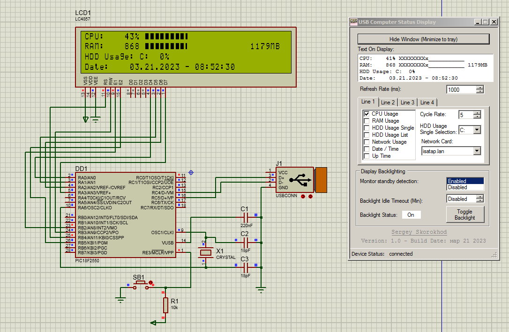

# USB Computer Status Display

*the project is not mine, but I have made some edits in working with the microcontroller.*

## Firmware

*This project can only be built correctly with MPLAB IDE 8.9.*

Firmware for PIC microcontroller.

|Hardware       |Model                  |
|:--------------|:----------------------|
|Microcontroller| PIC18f2550            |
|Display        | LCD HD44780 (40x4)    |

## Application

The application collects information about the system and sends.

## Proof of work

